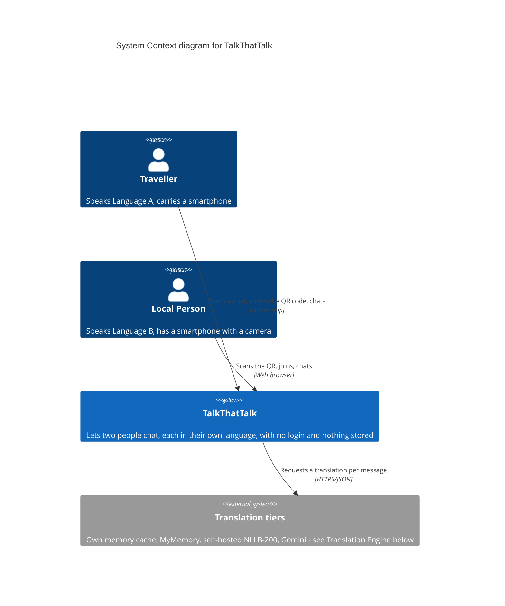
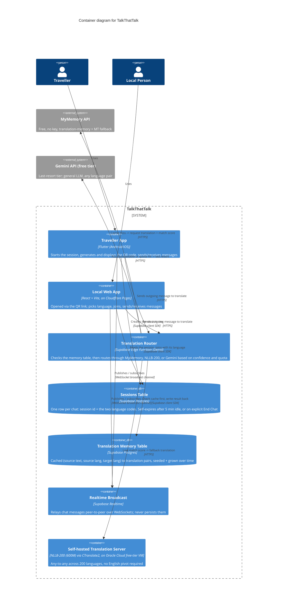
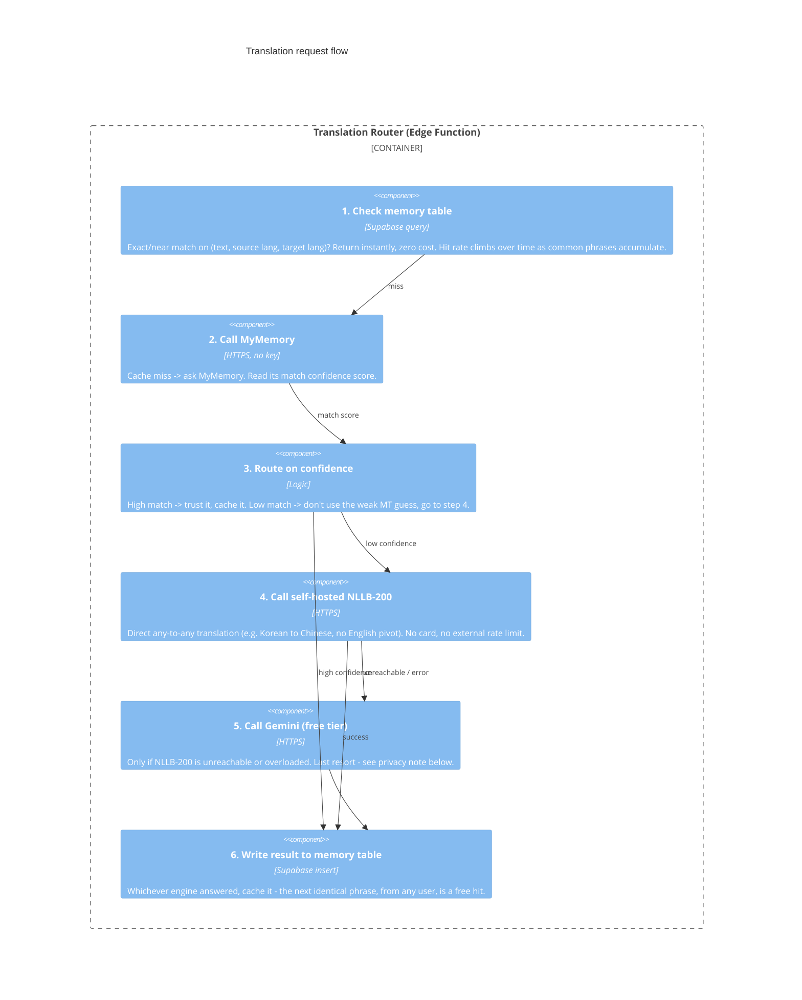

# TalkThatTalk

Talk to anyone, in your own language. No sign-up. Nothing saved.

TalkThatTalk is a zero-login, ephemeral chat for travellers. A traveller opens the app, picks
their language, and gets a QR code. A local person scans it with their phone's camera — no app
install — and lands straight in the chat in their own language. Each person types and reads in
their own language, live, in the same conversation. Close the chat (or walk away for 5 minutes)
and it's gone for good — nothing is ever written to a database.

Language pairs aren't limited to "X to English" — a Korean traveller talking to a Chinese-speaking
local, or a Japanese traveller talking to a Sinhala-speaking local, works the same way as any
English pair. See [Translation engine](#translation-engine---tiered-no-card-required-by-default)
below for how.

## Who uses what

- **Traveller → Flutter app** (Android/iOS). Installed once, reused in every country. Starts a
  chat and shows the QR code.
- **Local person → Web app** (browser, no install). Scanning the QR with the phone's stock camera
  opens a link straight into the chat.

This split is deliberate: the traveller is a repeat user, so a real app is worth it. The local
person is a one-time user who must never be asked to install anything.

## How it works

**Traveller (Flutter app):** pick language → tap *Start Chat* → app shows a QR code → hand the
phone to the other person → chat, each in your own language.

**Local person (Web app):** scan the QR → pick language → tap *Join* → chat.

**Either side:** tap *End Chat*, or leave it idle for 5 minutes — the conversation is never
stored, so there's nothing left to find afterward.

## Architecture — C4 model

### Level 1: System Context



### Level 2: Containers



### Level 3: Translation request flow



## Translation engine — tiered, no card required by default

Free translation APIs (Google, Azure) require a billing card on file even for their free tier.
Genuinely free, no-card options exist, but the obvious self-hosted pick, **LibreTranslate**,
doesn't support Sinhala at all — so it can't be the fallback for this app's main language pair.
The tiering below works around that, and handles direct non-English pairs (Korean↔Chinese,
Japanese↔Sinhala, etc.) the same way it handles English pairs.

| Tier | Engine | Card? | Any-to-any pairs? | Cost | Role |
| --- | --- | --- | --- | --- | --- |
| 1 | Your own memory table (Supabase) | No | Yes (whatever's cached) | Free, instant | Catches repeat phrases across all users |
| 2 | MyMemory | No | Yes, but weaker on non-English pairs | Free, 5K–50K chars/day | First external call, confidence-scored |
| 3 | Self-hosted NLLB-200 | No (model); host may ask | Yes, direct — 200 languages, no English pivot | Free, bounded by your VM | Main fallback for novel/low-confidence text |
| 4 | Gemini API (free tier) | No | Yes, strong on major languages | Free, ~1,000 req/day (Flash-Lite) | Last resort only — see caveats below |

**Why NLLB-200 instead of LibreTranslate:** LibreTranslate (Argos Translate) supports ~30
languages and Sinhala isn't one of them. NLLB-200 explicitly supports Sinhala (`sin_Sinh`) and
200 languages total, and — unlike older bilingual-model systems — translates directly between
any two of its languages without routing through English as an intermediate step.

⚠️ **License caveat (NLLB-200):** the official weights are **CC-BY-NC-4.0 — non-commercial use
only**, and Meta's model card says it isn't released for production deployment. Fine for a
student/personal-project build; revisit before any commercial launch — either license a paid
engine at that point, or properly vet a community MIT-relicensed checkpoint (e.g. Open-NLLB)
closer to launch. Giving the app away for free to end users does **not** by itself make this
non-commercial use under the license — "non-commercial" turns on intent (ads, resume/business
value, any future monetization path), not on whether users pay.

**Hosting:** running on the existing Oracle Cloud Always Free VM (ARM Ampere, multiple cores /
plenty of RAM) — comfortably fits the NLLB-200 distilled 600M model, which Render's free tier
(512 MB RAM) could not.

⚠️ **Privacy caveat (Gemini tier):** Gemini's free tier terms permit prompt data to be used for
model training/improvement. Since this app's core promise is "nothing is ever stored," routing a
message through the free Gemini API means that message content can leave the system in a way
that quietly conflicts with that promise, even though nothing is retained on the Supabase side.
Treat Gemini as a rare, clearly-scoped last resort (tier 4, only when NLLB-200 is unreachable),
not a default path — or budget for Gemini's paid tier later specifically for its no-training-use
guarantee once this matters more.

**Rate limits (Gemini free tier, subject to change):** Gemini 2.5 Flash-Lite gives the best free
volume — roughly 30 requests/minute, ~1,000 requests/day. No card required to start.

## Full stack

| Layer | Tech | Role |
| --- | --- | --- |
| Traveller client | Flutter (Android/iOS) | Installed app. Creates the session, renders the QR code, chat UI for the traveller. |
| Local client | React + Vite, on Cloudflare Pages | No install. Chat UI for the local person, reached via the QR link. |
| Realtime messaging | Supabase Realtime (Broadcast channels) | Messages travel peer-to-peer; nothing persisted. |
| Session pairing | Supabase Postgres | One `sessions` row per chat: session id + the two language codes. Deleted on explicit End Chat, or after 5 min idle via a scheduled cleanup job. |
| Translation memory | Supabase Postgres | `translations` table: cached (text, source lang, target lang) → translation. Seeded with ~100–200 common travel phrases, grows from every live translation after. |
| Translation routing | Supabase Edge Function (Deno) | Checks the memory table, calls MyMemory, reads its confidence score, falls back through NLLB-200 then Gemini in order. |
| Free translation fallback | NLLB-200 (600M, distilled), self-hosted via CTranslate2 | Runs on the Oracle Cloud free-tier VM. No card, no external cap, any-to-any across 200 languages. |
| Last-resort translation | Gemini API (free tier) | Used only if NLLB-200 is unreachable or overloaded. See privacy caveat above. |
| QR codes | `qr_flutter` (Flutter package) | Encodes the session join-URL. Scanned by the phone's own camera app — nothing to build on the web side. |

## Why no messages are stored

Messages travel peer-to-peer through a Supabase Realtime broadcast channel — the sessions
database only ever holds which two languages are paired, not what was said, and that row deletes
itself within 5 minutes either way (or immediately on End Chat). The translation memory table
stores translated *phrases* for reuse across users, not a record of who said what to whom or
when. The one caveat to this promise is the Gemini fallback tier — see above.

## Local development

### Local Web App

```
cd web
npm install
cp .env.example .env   # fill in your Supabase URL + anon key
npm run dev
```

### Traveller App (Flutter)

```
cd mobile
flutter pub get
cp .env.example .env   # fill in your Supabase URL + anon key
flutter run
```

### Self-hosted translation server (NLLB-200)

```
cd translation-server
pip install -r requirements.txt   # ctranslate2, transformers, sentencepiece
python download_model.py          # fetches facebook/nllb-200-distilled-600M
python serve.py                   # exposes a local HTTP endpoint the Edge Function calls
```

See `FULL_BUILD_GUIDE.md` in this repo for the complete step-by-step build, including the
Supabase schema (`sessions` + `translations` tables), the Edge Function's tiered routing logic,
the session-expiry cleanup job, and deployment instructions for all three pieces.

## Status

🚧 In development — not yet deployed. Web client, Flutter client, and the tiered translation
router are being built against the same Supabase backend described above.
